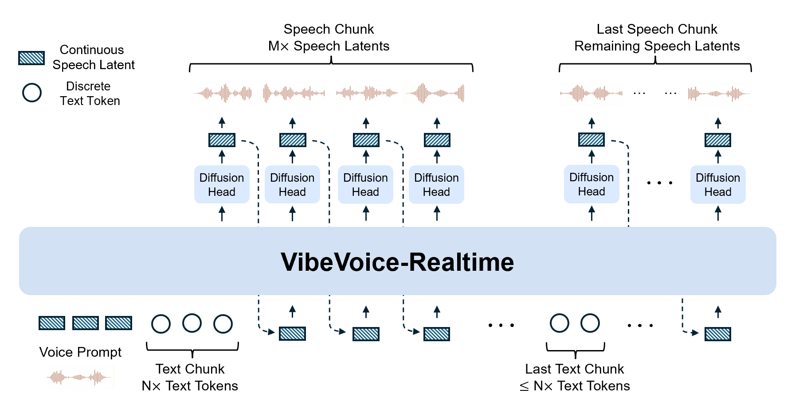

## VibeVoice: A Frontier Open-Source Text-to-Speech Model

VibeVoice-Realtime is a **lightweight real‑time** text-to-speech model supporting **streaming text input** and **robust long-form speech generation**. It can be used to build realtime TTS services, narrate live data streams, and let different LLMs start speaking from their very first tokens (plug in your preferred model) long before a full answer is generated. It produces initial audible speech in **~300 ms** (hardware dependent).

[▶️ Watch demo video](https://github.com/user-attachments/assets/0901d274-f6ae-46ef-a0fd-3c4fba4f76dc) (Launch your own realtime demo via the websocket example in [Usage](https://github.com/microsoft/VibeVoice/blob/main/docs/vibevoice-realtime-0.5b.md#usage-1-launch-real-time-websocket-demo))

Although the model is primarily built for English, we found that it still exhibits a certain level of multilingual capability—and even performs reasonably well in some languages. We provide nine additional languages (German, French, Italian, Japanese, Korean, Dutch, Polish, Portuguese, and Spanish) for users to explore and share feedback.

The model uses an interleaved, windowed design: it incrementally encodes incoming text chunks while, in parallel, continuing diffusion-based acoustic latent generation from prior context. Unlike the full multi-speaker long-form variants, this streaming model removes the semantic tokenizer and relies solely on an efficient acoustic tokenizer operating at an ultra-low frame rate (7.5 Hz).

Key features:
- Parameter size: 0.5B (deployment-friendly)
- Realtime TTS (~300 ms first audible latency)
- Streaming text input
- Robust long-form speech generation

  

This realtime variant supports only a single speaker. For multi-speaker conversational speech generation, please use other [VibeVoice models](https://huggingface.co/collections/microsoft/vibevoice). The model is currently intended for English speech only; other languages may produce unpredictable results.

➡️ **Technical Report:** [VibeVoice Technical Report](https://arxiv.org/abs/2508.19205)

➡️ **Project Page:** [microsoft/VibeVoice](https://microsoft.github.io/VibeVoice)

➡️ **Code:** [microsoft/VibeVoice-Code](https://github.com/microsoft/VibeVoice)

➡️ **App:** [anycoderapps/VibeVoice-Realtime-0.5B](https://huggingface.co/spaces/anycoderapps/VibeVoice-Realtime-0.5B)

## Training Details
Transformer-based Large Language Model (LLM) integrated with specialized acoustic tokenizer and a diffusion-based decoding head.
- LLM: [Qwen2.5-0.5B](https://huggingface.co/Qwen/Qwen2.5-0.5B) for this release.
- Tokenizers:
    - Acoustic Tokenizer: Based on a σ-VAE variant (proposed in [LatentLM](https://arxiv.org/pdf/2412.08635)), with a mirror-symmetric encoder-decoder structure featuring 7 stages of modified Transformer blocks. Achieves 3200x downsampling from 24kHz input. Decoder component is ~340M parameters.
- Diffusion Head: Lightweight module (4 layers, ~40M parameters) conditioned on LLM hidden states. Predicts acoustic VAE features using a Denoising Diffusion Probabilistic Models (DDPM) process. Uses Classifier-Free Guidance (CFG) and DPM-Solver (and variants) during inference.
- Context Length: Trained with a curriculum increasing up to 8,192 tokens.
- Training Stages:
    - Tokenizer Pre-training: Acoustic tokenizer is pre-trained.
    - VibeVoice Training: Pre-trained tokenizer is frozen; only the LLM and diffusion head parameters are trained. A curriculum learning strategy is used for input sequence length (4k -> 8K). Text tokenizer not explicitly specified, but the LLM (Qwen2.5) typically uses its own. Audio is "tokenized" via the acoustic tokenizer.

## Models
| Model | Context Length | Generation Length |  Weight |
|-------|----------------|----------|----------|
| VibeVoice-Realtime-0.5B | 8k | ~10 min | You are here. |
| VibeVoice-1.5B | 64K | ~90 min | [HF link](https://huggingface.co/microsoft/VibeVoice-1.5B) |
| VibeVoice-Large| 32K | ~45 min | [HF link](https://huggingface.co/microsoft/VibeVoice-Large) |

## Results

The model achieves satisfactory performance on short-sentence benchmarks, while the model is more focused on long‑form speech generation.

### Zero-shot TTS performance on LibriSpeech test-clean set

| Model | WER (%) ↓ | Speaker Similarity ↑ |
|:--------------------|:---------:|:----------------:|
| VALL-E 2            | 2.40      | 0.643            |
| Voicebox            | 1.90      | 0.662            |
| MELLE               | 2.10      | 0.625            |
| **VibeVoice-Realtime-0.5B** | 2.00 | 0.695            |

### Zero-shot TTS performance on SEED test-en set

| Model | WER (%) ↓ | Speaker Similarity ↑ |
|:--------------------|:---------:|:----------------:|
| MaskGCT             | 2.62      | 0.714            |
| Seed-TTS            | 2.25      | 0.762            |
| FireRedTTS          | 3.82      | 0.460            |
| SparkTTS            | 1.98      | 0.584            |
| CosyVoice2          | 2.57      | 0.652            |
| **VibeVoice-Realtime-0.5B** | 2.05 | 0.633            | 

## Installation and Usage

Please refer to [GitHub README](https://github.com/microsoft/VibeVoice/blob/main/docs/vibevoice-realtime-0.5b.md#installation)

## Responsible Usage
### Direct intended uses
The VibeVoice-Realtime model is limited to research purposes exploring real-time highly realistic audio generation detailed in the [tech report](https://arxiv.org/pdf/2508.19205). 

### Out-of-scope uses
Use in any manner that violates applicable laws or regulations (including trade compliance laws). Use in any other way that is prohibited by MIT License. Use to generate any text transcript. Furthermore, this release is not intended or licensed for any of the following scenarios:

- Voice impersonation without explicit, recorded consent, including but not limited to, cloning a real individual’s voice for satire, advertising, ransom, social‑engineering, or authentication bypass. 
- Disinformation or impersonation, including but not limited to, creating audio presented as genuine recordings of real people or events. 
- Real‑time or low‑latency voice conversion, including but not limited to, telephone or video‑conference “live deep‑fake” applications.
- Any act to circumvent, disable, or otherwise interfere with any technical or procedural safeguards implemented in this release, including but not limited to security controls, watermarking and other transparency mechanisms. Any act of reverse engineering, modification, injection of unauthorized code, or exploitation of vulnerabilities for purposes beyond the intended scope of use. 
- Unsupported language – the model is trained only on English data; outputs in other languages are unsupported and may be unintelligible or inappropriate.
- Generation of background ambience, Foley, or music – VibeVoice is speech‑only and cannot produce coherent non‑speech audio such as music.

## Risks and limitations
While efforts have been made to optimize it through various techniques, it may still produce outputs that are unexpected, biased, or inaccurate. VibeVoice may inherit any biases, errors, or omissions produced by its base model (specifically, Qwen2.5 0.5b in this release). 
Potential for Deepfakes and Disinformation: High-quality synthetic speech can be misused to create convincing fake audio content for impersonation, fraud, or spreading disinformation. Users must ensure transcripts are reliable, check content accuracy, and avoid using generated content in misleading ways. Users are expected to use the generated content and to deploy the models in a lawful manner, in full compliance with all applicable laws and regulations in the relevant jurisdictions. It is best practice to disclose the use of AI when sharing AI-generated content.
English only: Transcripts in language other than English may result in unexpected audio outputs.
Non-Speech Audio: The model focuses solely on speech synthesis and does not handle background noise, music, or other sound effects.
Overlapping Speech: The current model does not explicitly model or generate overlapping speech segments in conversations.
Code, formulas, and special symbols – The model does not currently support reading code, mathematical formulas, or uncommon symbols. Please pre‑process input text to remove or normalize such content to avoid unpredictable results.

## Recommendations
We do not recommend using VibeVoice in commercial or real-world applications without further testing and development. If you use this model to generate speech, we recommend disclosing to the end user that they are listening to AI generated content. This model is intended for research and development purposes only. Please use responsibly.

To mitigate the risks of misuse, we have:
Removed acoustic tokenizer to avoid users creating embedding on their own. 
Embedded an audible disclaimer (e.g. “This segment was generated by AI”) automatically into every synthesized audio file.
Added an imperceptible watermark to generated audio so third parties can verify VibeVoice provenance. Please see contact information at the end of this model card.
Users are responsible for sourcing their datasets legally. This may include securing appropriate rights and/or anonymizing data prior to use with VibeVoice. Users are reminded to be mindful of data privacy concerns. 

## Contact
This project was conducted by members of Microsoft Research. We welcome feedback and collaboration from our audience. If you have suggestions, questions, or observe unexpected/offensive behavior in our technology, please contact us at VibeVoice@microsoft.com.
If the team receives reports of undesired behavior or identifies issues independently, we will update this repository with appropriate mitigations.
